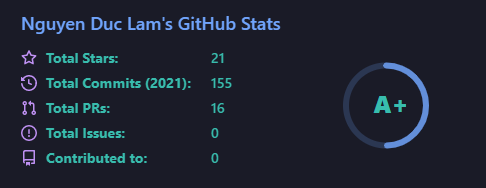

## Hi I'm Ethernal-Serenade (Real name is Nguyễn Đức Lâm)

![Ethernal-Serenade]

:computer: Developer at SCIREN, Ho Chi Minh City

### My GitHub Stats

### My Tech Stack
![Map, Remote Sensing and GIS]: Related to WebGIS :earth_americas:, WebMap :world_map:, WebRS :artificial_satellite:

#### Frontend

#### Database

#### Others

