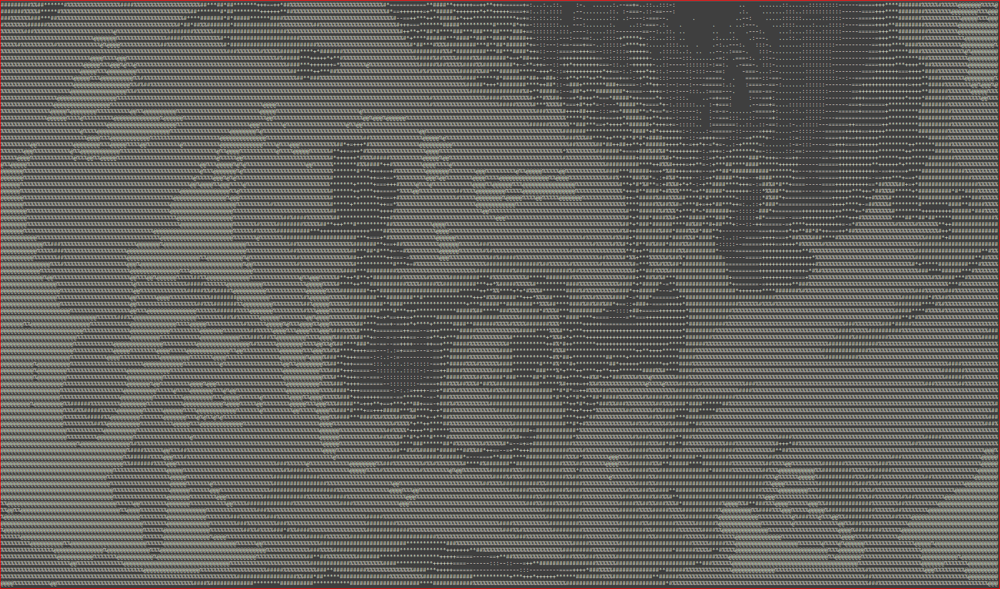

# 
Hi I'm Ethernal Serenade (Real name is Nguyễn Đức Lâm)

+ :computer: Leader Develop at LAHUTH teams (SCIREN)
+ :computer: Software Engineer - INTELLI Technology JSC

## GitHub Statictis

<!--  -->

## Technique Stack
My products related to WebGIS :earth_americas:, WebMap :world_map:, WebRS :artificial_satellite:

## Frontend, Backend, Database, Web Server, Version Control, IDEs and Operating System

 
:pushpin:

:pushpin:

:pushpin:

:pushpin:

:pushpin:

:pushpin:

  

